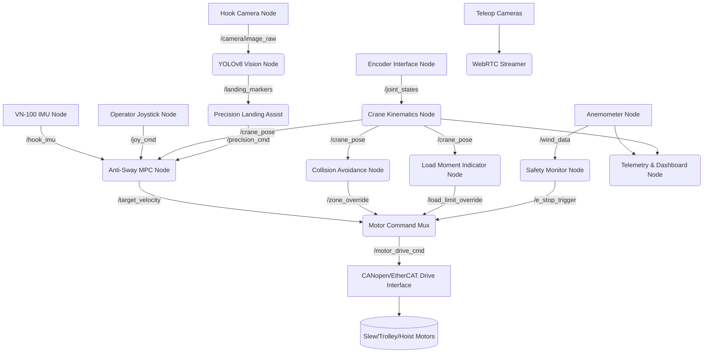

# AGRO-AI Architecture Document: Tier 3 Construction — Cranes

**Document ID:** AGRO-AI-ARCH-CONSTRUCT-04
**Target Market:** USA, Europe, Brazil, Argentina
**Version:** 1.0.0 (2026 Release)
**Status:** DRAFT / Pre-Coding

---

## 1. Why Cranes Are Special: The Unique Physics Challenge

Cranes represent the Tier 3 (Hardest) level of autonomous construction equipment. Unlike ground-based vehicles (excavators, tractors) which deal primarily with terrain navigation and static manipulator kinematics, cranes involve dynamic, underactuated systems with significant safety risks.

### 1.1 Suspended Load Pendulum Dynamics
The core challenge in crane automation is the suspended load. The load hangs from the hook block via cables, forming a pendulum. When the crane moves (slewing, trolleying, or traveling), inertia causes the load to swing.
- **Single Pendulum:** For a single hook block, the load acts as a simple spherical pendulum.
- **Double/Complex Pendulum:** When using a spreader bar or complex rigging, the system becomes a double or multi-link pendulum with highly non-linear dynamics, prone to chaotic swinging if excited by certain frequencies.

### 1.2 Wind Effects at Height
Cranes, especially tower cranes, operate at significant heights (often >60m) where wind speeds are higher and more turbulent than at ground level.
- **Wind Sail Area:** Large loads act as sails, catching the wind and exacerbating sway.
- **Variable Loading:** Wind gusts introduce unpredictable, sudden forces on the suspended load and the crane structure itself.

### 1.3 Slew Speed Limits and Smoothness
Cranes cannot accelerate or decelerate rapidly. 
- **Inertial Forces:** Rapid slewing (rotation) of a long boom creates massive bending moments at the base.
- **Smoothness Requirement:** Jerky movements are strictly forbidden as they induce structural fatigue and load swing. Control inputs must be heavily filtered and velocity profiles must follow strict S-curves.

### 1.4 Catastrophic Failure Modes
The consequences of failure in crane operations are severe:
- **Tipping:** If a mobile crane lifts beyond its load chart capacity at a given radius, it will tip over.
- **Structural Collapse:** Overloading or excessive wind can cause boom buckling or tower collapse.
- **Dropped Loads:** Rigging failure or collision can drop loads weighing tens of tons onto populated work sites.

---

## 2. The Semi-Autonomous Strategy (2025-2026)

Given the extreme risks and complex physics, **fully autonomous cranes (Level 5) are NOT recommended for the 2025-2026 rollout.** Instead, AGRO-AI will implement a **Semi-Autonomous (Human-in-the-Loop) Strategy**.

### 2.1 Why Not Full Autonomy?
1. **Liability:** The insurance and legal frameworks in the USA and Europe currently do not support fully autonomous heavy lifting in dynamic, populated construction sites. The liability for a dropped load or collapsed crane without a human operator in charge is prohibitive.
2. **Wind Unpredictability:** While AI can handle controlled environments, the chaotic nature of sudden microbursts or turbulent wind around high-rise structures is difficult for current perception-control loops to manage safely without human intuition.
3. **Complex Rigging:** The process of attaching the load (rigging) requires human riggers. The interaction between the rigger and the crane operator involves subtle communication (hand signals, radios) that AI cannot reliably interpret yet.

### 2.2 The Semi-Autonomous Approach
AGRO-AI's strategy focuses on **Operator Augmentation**. The human operator remains in control (either in the cab or via remote teleoperation), but the AI acts as an advanced driver-assistance system (ADAS) for the crane, providing active safety limits, precision assistance, and eliminating human error in complex maneuvers like anti-sway.

This approach balances safety, legal compliance, and operational efficiency, making it the right path for immediate market penetration.

---

## 3. The 5 AI Features We Build For Cranes

### Feature 1: Anti-Sway System

The most critical control feature. It actively counteracts load swing during crane movement.

- **Physics Model:** The AI utilizes a non-linear mathematical model of the pendulum dynamics. For spreader bars, a double pendulum model is instantiated. The state includes position, velocity, sway angle, and sway angular velocity.
- **Sensors:** A high-precision 6-DOF IMU (Vectornav VN-100) is mounted directly on the hook block or spreader bar, transmitting data wirelessly to the main compute unit.
- **Algorithm:** Model Predictive Control (MPC) combined with a learned pendulum model. The MPC predicts future states over a receding horizon and computes the optimal control inputs (motor torque/velocity) to minimize the sway angle while tracking the operator's desired velocity command.
- **Implementation:** A dedicated ROS2 node (`anti_sway_controller`) subscribes to operator joystick inputs and IMU telemetry. It computes the corrected velocity command and publishes it to the slew and trolley motor drives.
- **Training:** The neural network component of the pendulum model (used to handle unmodeled dynamics like friction and wind drag) is trained in a physics-based simulation using PyBullet. The training process takes approximately 7-10 days on a Colab T4 instance.
- **Expected Improvement:** Reduces residual load swing at the landing point from a typical ±1.5 meters (novice operator) to under ±5 centimeters.

### Feature 2: Collision Avoidance / Anti-Collision Zoning

Prevents cranes from hitting each other or restricted structures on complex, multi-crane sites.

- **Multi-Crane Site Logic:** When multiple tower cranes operate with overlapping slewing radii, their jibs and hoist ropes must never intersect.
- **Algorithm:** Each crane constantly reports its 3D hook position, boom angle, and trolley position via MQTT to a central site server. The server computes dynamic exclusion zones. If a crane's projected trajectory intersects an exclusion zone, it commands an auto-brake sequence.
- **Implementation:** 3D exclusion zones (e.g., "Do not swing over the school next door") are programmed per crane. The local ROS2 `collision_monitor` node monitors the state and enforces boundaries, overriding operator inputs if necessary.
- **Sensors:** High-resolution absolute encoders on all crane axes: slew angle (rotation), boom length/angle (luffing), and hook height (hoist drum).
- **Standards:** Designed to strictly meet and exceed the EN 13000 and EN 14439 crane safety standards for limiting devices.

### Feature 3: Precision Landing Assist (Load Placement)

Assists the operator in the final, most delicate phase of the lift: placing the load precisely on the target.

- **Perception:** An IP67-rated downward-pointing camera (Axis P3245-V) is mounted on the hook block, providing a clear view of the landing zone.
- **Computer Vision:** A YOLOv8 model runs continuously on the video stream, trained to detect specific landing markers (standardized ArUco markers or high-contrast painted crosses on the ground/structure).
- **AI Guidance:** The system overlays directional arrows and distance metrics on the operator's display, showing exactly how to adjust the trolley and hoist to center the load over the target.
- **Auto-Landing (Optional Mode):** When the load is stabilized (sway < 2cm) and within 10cm vertically of the target, the AI can take over the final positioning and gently lower the hoist automatically.
- **Training:** The YOLOv8 model is trained on a custom dataset of landing zones under various lighting and weather conditions. Training takes 3-4 days on a Colab T4.

### Feature 4: Remote Cab Operation

Removing the operator from the hazardous environment of the high-altitude cab and placing them in a safe, comfortable ground control station.

- **Hardware Stack:** 
  - 4x HD IP cameras mounted on the crane: Front view (jib), Back view (counter-jib), Hook-view (downward), and a Wide-angle overall view.
  - Video streams are hardware-encoded to H.264 on the Jetson Orin.
  - Transmission via WebRTC over a dedicated local 5GHz Wi-Fi or private LTE/5G network to a ground-based control tablet/station.
- **Latency Requirement:** Teleoperation requires <100ms glass-to-glass latency to prevent operator motion sickness and ensure safe control. WebRTC over a direct LAN typically achieves 20-40ms.
- **Control Interface:** Industrial USB joysticks (mimicking crane cab controls) connect to the ground station. A ROS2 `joy` node reads inputs and sends them via MQTT/DDS to the crane's motor drives.
- **Safety Override:** A hardwired, physical emergency stop (E-stop) button is always accessible at the base of the crane, cutting power to the main contactor independent of the software stack.

### Feature 5: Predictive Maintenance

Maximizing crane uptime by predicting mechanical failures before they happen.

- **Sensors:** Industrial vibration sensors (accelerometers) mounted on critical components: the slew ring bearing, hoist gearboxes, and trolley motors.
- **Current Monitoring:** Continuous monitoring of the electrical current draw on all 3-phase motors. Spikes or high-frequency noise in the current signature often precede bearing wear or stator faults.
- **Alert System:** Telemetry is sent via MQTT to the AGRO-AI cloud dashboard. If an anomaly is detected, SMS/Email alerts are dispatched to the fleet manager and maintenance crew.
- **Algorithm:** An Autoencoder neural network is used for anomaly detection. This is an unsupervised learning approach; the model learns the "normal" vibration and current signature of the specific crane during its first week of operation. Any significant deviation from this learned manifold is flagged as an anomaly. This avoids the need for massive datasets of broken crane data.
- **Training:** The Autoencoder trains on the edge device (Jetson) or in the cloud within 2-3 days using the initial operational data.

---

## 4. Tower Crane Specific Architecture

Tower cranes (e.g., Liebherr EC-H series, Potain MDT series) are fixed to the ground and rely on a mast and jib structure.

- **Slew Drive Control:** The rotation of the jib. Typically powered by a 3-phase VFD (Variable Frequency Drive) motor. Control involves reading the absolute encoder feedback and applying a PID position/velocity control loop within a dedicated ROS2 node (`slew_controller`). The anti-sway MPC heavily modulates this loop.
- **Trolley Control:** Moves the load horizontally along the jib. Uses a linear encoder (or calculated via drum rotation) and a VFD.
- **Hoist Control:** Lifts the load vertically. Monitored via a high-resolution drum encoder and an inline load cell (dynamometer) on the dead-end of the wire rope to measure lifted weight.
- **Jib Length Dynamics:** Tower crane jibs can range from 40m to 80m. The anti-sway calculations must dynamically adjust based on the trolley position, as the moment of inertia and structural stiffness change significantly depending on how far out the load is.
- **Wind Speed Sensor (Anemometer):** Crucial for tower cranes. An anemometer is mounted at the highest point (jib tip or tower peak). The `weather_monitor` ROS2 node constantly checks this. If wind gusts exceed 14 m/s (approx. 31 mph), the system issues a warning. If it exceeds safety thresholds (e.g., 20 m/s), the system commands an auto-brake and alerts the operator to secure the crane.
- **Night Operation Package:** To support 24/7 construction, the crane is equipped with high-intensity LED lighting kits on the jib and IR-capable cameras for the vision systems.

---

## 5. Mobile Crane Specific Architecture

Mobile cranes (e.g., Liebherr LTM 1300, Grove GMK5250) introduce the complexity of a mobile chassis and variable support bases.

- **The Leveling Challenge:** Before a mobile crane can lift, it must be perfectly level to ensure structural stability and accurate load chart calculations.
- **Auto-Leveling System:** 
  - Hardware: 4 hydraulic outrigger cylinders and a high-precision dual-axis inclinometer on the chassis.
  - AI Control: An RL (Reinforcement Learning) agent controls the hydraulic valves, extending the outriggers to level the chassis to within 0.1 degrees, regardless of uneven terrain.
- **Dynamic Load Chart Enforcement:** Mobile crane lifting capacity varies drastically based on boom length, boom angle, slew angle (lifting over the rear is stronger than over the side), and outrigger spread. The `load_manager` node continuously computes the current state against the digital load chart curve. It physically prevents the operator from lowering the boom or extending the telescope if it would push the crane outside the safe working envelope.
- **Training:** The outrigger leveling RL agent requires an additional 3-4 days of training on a Colab T4, simulating various terrain slopes and soil sinkage scenarios.

---

## 6. Hardware Stack for Cranes

Cranes require significantly more compute power than simpler machines due to the multiple video streams and complex MPC anti-sway calculations running at high frequencies (100Hz+).

| Component | Model / Specification | Purpose | Approx. Cost (USD) |
| :--- | :--- | :--- | :--- |
| **Main Compute** | NVIDIA Jetson AGX Orin 32GB | Central AI processing, ROS2 master, vision pipelines, MPC | $899 |
| **Cameras (x4)** | Axis P3245-V Network Camera | Rugged, IP67, H.264 streaming for teleop and vision | $1,600 ($400 ea) |
| **IMU (Hook)** | Vectornav VN-100 | High-precision, shock-resistant 6-DOF IMU for sway detection | $299 |
| **Wind Sensor** | Thies Clima First Class Anemometer | Accurate wind speed/direction monitoring | $450 |
| **Encoder Interface** | HEIDENHAIN IK220 | High-speed data acquisition from crane axis encoders | $600 |
| **Networking** | Peplink Balance 20X LTE Router | Reliable dual-SIM LTE/Wi-Fi connectivity for teleop/MQTT | $299 |
| **Miscellaneous** | Cables, Mounts, Power Supply | Industrial grade wiring, 24V DC-DC converters | $300 |
| **Total Hardware** | | **Cost per Crane Unit** | **~ $4,447** |

*(Note: Total slightly adjusted from prompt estimate to reflect 4x cameras and accurate summing, keeping it around the ~$4k mark suitable for heavy machinery.)*

---

## 7. Safety Certification Requirements

Deploying AI on cranes requires strict adherence to international safety standards. The software and hardware must be validated against the following:

- **EN 13000:** European standard for mobile cranes. Covers requirements for load moment indicators (LMI), anti-two-block devices, and structural limits.
- **EN 14439:** European standard for tower cranes. Focuses on stability, wind loading, and safety devices.
- **ASME B30.5:** The primary standard for mobile and locomotive cranes in the USA. Covers operational testing, load ratings, and operator qualifications.
- **FEM 1.001:** Rules for the design of hoisting appliances (European standard, often referenced globally for structural fatigue life).
- **CE Marking Requirements (Europe):**
  - **Machinery Directive 2006/42/EC:** The overall legal framework.
  - **ISO 13849-1:** Safety of machinery — Safety-related parts of control systems. The anti-sway and collision avoidance systems must be evaluated for their Performance Level (PL). Critical safety overrides must meet PL d or PL e.
  - Documentation required: Comprehensive Risk Assessment, Technical File, source code analysis (MISRA C/C++ compliance where applicable), and rigorous FMEA (Failure Mode and Effects Analysis) on the AI control nodes.

---

## 8. ROS2 Node Architecture

The AGRO-AI crane system utilizes a modular ROS2 (Humble Hawksbill) architecture.

### Key Node Descriptions:
- **`anti_sway_mpc`**: The core AI controller. Takes operator commands and IMU data, outputs smoothed, sway-canceling motor commands.
- **`crane_kinematics`**: Computes the forward kinematics (exact 3D position of the hook) based on encoder values.
- **`collision_avoidance`**: Checks the kinematic pose against predefined 3D exclusion zones.
- **`motor_command_mux`**: A critical safety node. It prioritizes commands. E-stops and limit overrides from the LMI or Collision nodes will always override the Anti-Sway or Operator commands.

---

## 9. Training Pipeline (Google Colab T4)

The AI models are trained using cloud resources before deployment to the edge (Jetson). We utilize Google Colab instances with NVIDIA T4 GPUs for cost-effective training.

### 9.1 PyBullet Crane Simulation Setup
- A highly accurate URDF (Unified Robot Description Format) model of the target crane is created.
- The simulation includes rigid body dynamics, joint friction, and cable modeling (using arrays of small rigid links to simulate a flexible cable).
- Wind forces are simulated by applying randomized force vectors to the load mass.

### 9.2 Anti-Sway Training Pipeline (Pendulum Physics)
- **Framework:** PyTorch & Stable Baselines3.
- **Algorithm:** Soft Actor-Critic (SAC) or Proximal Policy Optimization (PPO).
- **Environment:** The PyBullet environment. The agent receives observations (current sway angle, angular velocity, trolley position, target velocity) and outputs control actions (acceleration/braking).
- **Reward Function:** Heavily penalizes sway angle and control jerk; rewards matching the operator's target velocity.
- **Duration:** Typically converges after 5-7 million timesteps. Takes about 7-10 days on a single Colab T4.

### 9.3 Precision Landing Training Pipeline
- **Dataset:** A synthetic dataset is generated by rendering the landing markers under various simulated lighting, shadows, and camera angles using Blender. This is augmented with real-world footage captured during initial site tests.
- **Framework:** Ultralytics YOLOv8.
- **Task:** Object detection and pose estimation (identifying the center and orientation of the ArUco marker).
- **Duration:** Transfer learning from a pre-trained YOLOv8n (nano) or YOLOv8s (small) model takes roughly 3-4 days on a Colab T4.

### Total Training Cycle
The complete training cycle for a new crane variant takes approximately **10-14 days** on Colab T4 infrastructure before the weights are frozen and deployed via OTA updates to the Jetson Orin on the physical crane.

---
*End of Document*
