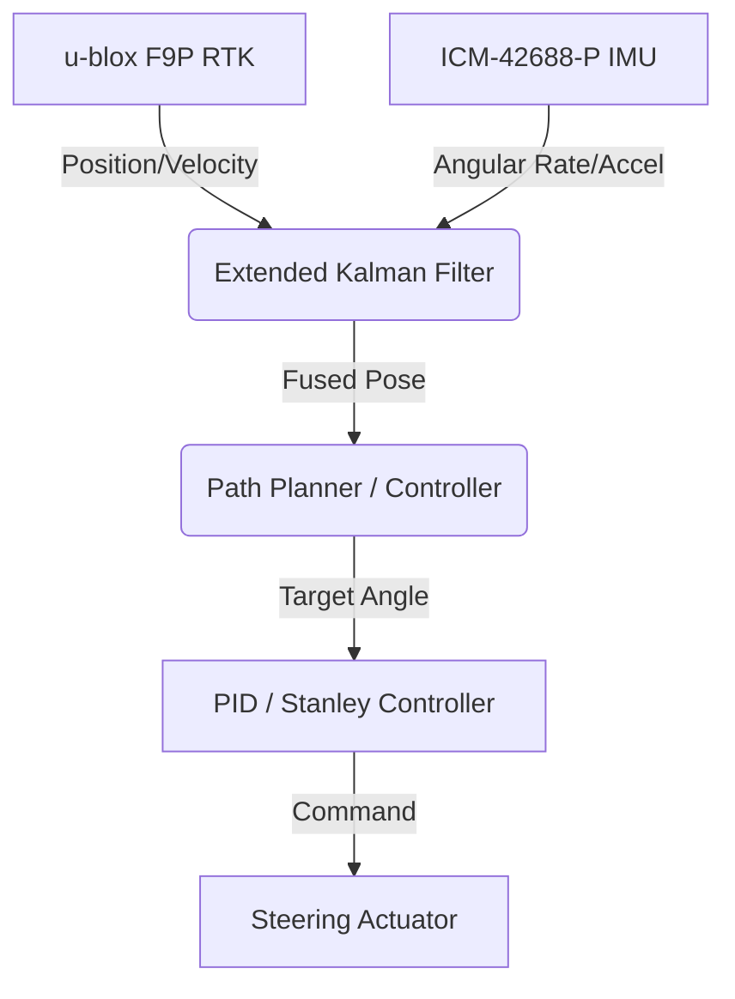

# AGRO-AI Architecture: Tier 1 Farming Equipment (GPS-Only Auto-Steer)

**Version:** 1.0.0
**Domain:** Agricultural Robotics (Tractors and Pull-Behind Implements)
**Scope:** GPS-only Auto-Steering and Basic ISOBUS Automation (No Vision/Neural Networks Required)
**Target Markets:** USA, Europe, Brazil, Argentina

---

## 1. Auto-Steer System Architecture

The Tier 1 system relies purely on highly accurate RTK-GPS localization combined with an Inertial Measurement Unit (IMU) to calculate heading and precise implement location. This architecture avoids complex neural networks, allowing it to run on embedded edge devices like a Raspberry Pi 4 or Jetson Orin Nano with minimal computational overhead.

### 1.1 RTK-GPS Signal Flow

Standard GPS only provides 2-meter accuracy, which is completely unusable for farming operations like seeding or harvesting, where a 2-meter error means crushed crops. Real-Time Kinematic (RTK) GPS corrects atmospheric timing errors to deliver **1-2 cm accuracy**.

**The Data Flow:**
1. A 4G LTE modem establishes an internet connection and connects to an **NTRIP caster** (Networked Transport of RTCM via Internet Protocol).
2. The NTRIP caster provides a continuous stream of RTCM3 correction data from a nearby base station (or a Virtual Reference Station).
3. The correction stream is injected into the **u-blox ZED-F9P** receiver via UART or USB.
4. The F9P processes the satellite signals (L1/L2 bands across GPS, GLONASS, Galileo, BeiDou) against the RTCM corrections.
5. The receiver outputs precise NMEA 0183 or UBX binary data at 10Hz-20Hz containing the highly accurate RTK `FIX` position.

### 1.2 Sensor Fusion: EKF (Extended Kalman Filter)

While RTK-GPS provides accurate X/Y coordinates, it can drop out momentarily under tree canopies or experience latency. Furthermore, GPS provides poor instantaneous heading information at low speeds. 
We fuse the RTK-GPS position with an **IMU (ICM-42688-P)** using an Extended Kalman Filter (EKF).

The EKF operates at 100Hz, ensuring that the steering controller receives smooth, continuous pose and heading estimates even if the RTK signal temporarily degrades from `FIX` to `FLOAT`.

### 1.3 Steering Actuator Types

There are two primary ways AGRO-AI commands the physical steering of the tractor:

1. **Electric Steering Wheel Motor:** A retrofit electric motor installed directly on the steering column (e.g., Danfoss PVED-CLS style or universal friction-drive motors). This is cheap, easy to install, but has slight latency and less torque.
2. **Hydraulic Proportional Valve (Steer-by-Wire):** Intercepting the hydraulic steering lines with an electro-hydraulic proportional valve (e.g., HydraForce). This provides maximum precision and torque for large articulated 4WD tractors (John Deere 9R) but requires tapping into the hydraulic circuit.

### 1.4 Steering Controller

The AGRO-AI system uses a modified **Stanley Controller** with an underlying **PID loop** to translate path deviation into steering angle commands.

**PID Tuning for Tractor Dynamics:**
- **Proportional (P):** Corrects immediate cross-track error. High values cause oscillation; low values cause sluggish correction. Must be tuned based on tractor wheelbase and weight.
- **Integral (I):** Corrects steady-state error (e.g., side-draft on a slope or when pulling a heavy off-center implement).
- **Derivative (D):** Dampens the response to prevent overshooting the A-B line.

### 1.5 Coverage Planning and A-B Lines

Farmers define their field logic using **A-B lines**.
1. **Point A:** The farmer drives to the start of the field and marks Point A on the AGRO-AI tablet.
2. **Point B:** The farmer drives down the first swath and marks Point B.
3. The AI computes an infinite straight line passing through A and B.
4. Using the known **Implement Width**, the AI computes parallel swath lines across the entire field polygon to ensure minimal overlap (typically < 2%).

### 1.6 Implement Offset Compensation

The GPS antenna is mounted on the tractor cab roof, but the work is happening at the implement, which could be hitched 5 meters behind the tractor.
AGRO-AI calculates the actual implement position using kinematic models (a bicycle model extended with a trailer joint).
`Implement_X = Tractor_X - (Hitch_Length * cos(Tractor_Heading))`
`Implement_Y = Tractor_Y - (Hitch_Length * sin(Tractor_Heading))`

### 1.7 Headland Management

The "headland" is the unplanted/unworked boundary area around the edge of the field used for turning.
When the AI detects the tractor approaching the defined field boundary (GeoJSON polygon):
1. **Reduce Speed:** Commands the CAN bus to lower engine RPM / CVT ratio.
2. **Raise Implement:** Sends an ISOBUS/CAN command to the 3-point hitch or hydraulic remotes to raise the plow/seeder out of the ground.
3. **Turn:** Executes a pre-calculated Dubins path or clothoid curve to align with the next A-B line.
4. **Lower Implement:** Drops the implement back in precisely as the new swath begins.

---

## 2. ISOBUS (ISO 11783) Integration

ISOBUS is the critical industry standard that allows ANY tractor (John Deere, New Holland, Case IH) to communicate with ANY implement (Amazone, Kuhn, Great Plains) over a standardized CAN bus network.

### 2.1 Core ISOBUS Components

- **Virtual Terminal (VT) / Universal Terminal (UT):** The graphical user interface on the tractor display. AGRO-AI renders the implement's UI by downloading the object pool from the implement ECU.
- **Task Controller (TC):** The brains behind precision ag. It logs what was done (TC-BAS), controls variable rates based on GPS (TC-GEO), and switches sections on/off (TC-SC).

### 2.2 Section Control (TC-SC)

To avoid wasting expensive seed or fertilizer, Section Control uses the RTK-GPS position to determine if a specific boom section or planter row is over an area that has *already been covered* or is *outside the field boundary*. If so, the AGRO-AI ISOBUS node commands that specific section to shut off instantly.

### 2.3 Hardware/Software Interface

- **Hardware:** PEAK PCAN-USB adapter connected to the Raspberry Pi / Jetson. The 9-pin INCAB connector interfaces with the tractor's ISOBUS network.
- **Software:** We utilize `isobus-python` and `python-can` to parse ISO 11783 J1939 messages, handle address claiming, and encode/decode PGNs (Parameter Group Numbers).

---

## 3. Variable Rate Application (VRA)

Variable Rate Application ensures that seeds, fertilizers, and chemicals are applied only where needed, based on a Prescription Map.

1. **The Prescription Map:** A GeoTIFF or ESRI Shapefile generated from satellite NDVI data (e.g., Sentinel-2) or soil sampling. It divides the field into zones (High Yield, Low Yield, Average).
2. **GPS Lookup:** The `ekf_localizer` node outputs the current global (Lat/Lon) position at 10Hz.
3. **Map Query:** The `vra_controller` node queries the GeoTIFF at that coordinate to find the target rate (e.g., 150 lbs/acre).
4. **Command Output:** The target rate is broadcast via ISOBUS TC-GEO to the implement ECU, which adjusts hydraulic motor speed or metering rollers in real-time.

---

## 4. Implement-Specific Implementations

### 4.1 TRACTOR (Row-Crop, Utility, Articulated 4WD)
*Examples: John Deere 8R, New Holland T5, Case IH Steiger*

**Hardware:** 
u-blox F9P + ICM-42688-P IMU + Jetson Orin Nano (or Pi 4) + PEAK PCAN-USB + Electric Steering Motor.

**ROS2 Architecture:**
- `gps_driver`: Reads NMEA, publishes `sensor_msgs/NavSatFix`.
- `imu_driver`: Reads IMU, publishes `sensor_msgs/Imu`.
- `ekf_localizer`: `robot_localization` package, outputs `nav_msgs/Odometry`.
- `path_planner`: Generates A-B lines and Dubins turn paths.
- `steering_controller`: Implements Stanley control, outputs steering angle to CAN.
- `headland_manager`: State machine managing implement lift/drop and turn execution.
- `isobus_tc`: Handles Task Controller communications.

**Training Needed:** 0 days. Tier 1 is purely deterministic geometric math and control theory. No neural networks are used for basic auto-steer.

---

### 4.2 SEED DRILL / AIR SEEDER
*Examples: John Deere 1890, Great Plains YP-825*

- **Section Control:** Relies heavily on ISOBUS TC-SC. Air seeders use pneumatic valves to shut off seed flow to specific manifolds at field boundaries or point rows, preventing double-planting.
- **Population Monitoring:** Optical or acoustic sensors on every seed tube monitor seed flow. AGRO-AI reads these PGNs to map actual planted population vs. target population.
- **VRA Control:** Adjusts the hydraulic drive on the main seed meters based on the prescription map.

---

### 4.3 FERTILIZER SPREADER
*Examples: Amazone ZA-V, John Deere DN345*

- **Variable Rate Spreading:** The spreader drops fertilizer onto spinning discs. By opening/closing the drop gates via electric actuators commanded by ISOBUS, the rate is varied across the field zones.
- **Section Control:** The left and right discs can be controlled independently. At an angled field edge, the left side can be shut off while the right side continues spreading.
- **Spread Pattern Correction:** High-end models adjust the drop point on the spinning disc to compensate for side winds (basic wind data can be fed into AGRO-AI).

---

### 4.4 MOLDBOARD PLOW / CHISEL PLOW / DISC HARROW / CULTIVATOR / RIPPER
*Examples: Kuhn, Lemken, Case IH*

- **Passive Dynamics:** These tools have no active electronics or ISOBUS ECUs. They are purely mechanical.
- **Control Vector:** The only automation required is **Depth Control**. AGRO-AI sends J1939 CAN commands to the tractor's rear 3-point hitch or hydraulic SCV (Selective Control Valve) to raise the implement at the start of a headland turn and lower it at the completion of the turn.

---

### 4.5 MANURE SPREADER
*Examples: Kuhn Profile 1300, New Holland 680*

- **Variable Rate PTO Control:** Manure spreaders run off the tractor's Power Take-Off (PTO) shaft. To vary the application rate, AGRO-AI commands the tractor's CVT (Continuously Variable Transmission) to speed up or slow down the tractor's ground speed while maintaining a constant engine RPM and PTO speed.
- **Boundary Shutoff:** Closes the rear hydraulic gate instantly via CAN command when the GPS position crosses the field boundary to prevent spreading manure on public roads or waterways.

---

### 4.6 MOWER-CONDITIONER / WINDROWER / HAY RAKE / TEDDER
*Examples: Kuhn FC 8835, MacDon D65*

- **Header Height Control (HHC):** While mostly handled by the implement's own ECU using ground skids, AGRO-AI can log the cutting height.
- **GPS Swath Overlap:** Extremely critical for mowing. If you overlap by 5%, you are wasting fuel. If you leave a 2cm gap, you leave a stripe of uncut crop. The 1-2cm RTK accuracy of AGRO-AI ensures perfect A-B lines for mowers.

---

### 4.7 BALE WRAPPER
*Examples: McHale Fusion 3, Kverneland 7816*

- **Automation Logic:** When the baler drops a bale, the wrapper follows. Using a basic ultrasonic or time-of-flight sensor on an Arduino (interfaced with AGRO-AI), the system detects a bale enters the loading arm.
- **Execution:** Triggers the wrapping sequence via ISOBUS without needing GPS input. The tractor auto-steer handles driving perfectly down the windrow while the operator focuses on bale wrapping logistics.

---

## 5. Complete Hardware BOM (Bill of Materials)

For a complete Tier 1 aftermarket auto-steer retrofit on a legacy tractor:

| Component | Description / Spec | Est. Cost (USD) |
| :--- | :--- | :--- |
| **u-blox ZED-F9P** | Dual-band RTK-GPS receiver module | $149.00 |
| **Ardusimple RTK2B** | Carrier board for the F9P | $175.00 |
| **GPS Antenna** | Multiband ANN-MB-00 IP67 | $60.00 |
| **4G/LTE Modem** | NTRIP client modem (Quectel EC25) | $120.00 |
| **IMU** | InvenSense ICM-42688-P (6-axis) | $25.00 |
| **Compute Node** | Jetson Orin Nano 8GB (or Raspberry Pi 4 8GB) | $499.00 ($75 for Pi) |
| **CAN Interface** | PEAK PCAN-USB (Opto-decoupled) | $250.00 |
| **Steering Actuator** | Electric friction-drive steering wheel motor | $350.00 |
| **Display** | 10-inch ruggedized capacitive touchscreen | $180.00 |
| **Enclosure** | IP67 Aluminum housing with Deutsch connectors | $60.00 |
| **Cabling** | Assorted J1939 ISOBUS and power cables | $90.00 |
| **TOTAL (Jetson)** | Premium Build for future AI scaling | **$1,958.00** |
| **TOTAL (Pi 4)** | Budget Build (Tier 1 strictly) | **$1,534.00** |

---

## 6. Competitive Analysis

AGRO-AI enters a market dominated by massive legacy players. Our advantage is **hardware agnosticism, open architecture, and dramatically lower price points.**

### 6.1 Trimble Nav-900 / GFX-1060
- **Incumbent Cost:** $25,000 - $40,000 for a full RTK install.
- **AGRO-AI Advantage:** We target a retail price of **$8,000 - $12,000**, delivering a 60% cost reduction. Trimble locks users into expensive annual RTK unlock subscriptions; AGRO-AI supports open NTRIP casters natively.

### 6.2 John Deere AutoTrac
- **Incumbent Weakness:** AutoTrac works flawlessly—but *only* on green tractors. It forms a walled garden. A farmer with a mixed fleet (Deere tractor, Case combine, New Holland sprayer) must buy three different proprietary systems.
- **AGRO-AI Advantage:** Utterly brand agnostic. By speaking standard ISOBUS J1939 and utilizing universal steering motors, AGRO-AI can be installed on a 2024 John Deere 8R or a 1995 Ford Genesis.

### 6.3 Raven Viper 4+
- **Incumbent Cost:** ~$15,000 for display and basic steering, plus highly expensive unlocks for VRA and Section Control.
- **AGRO-AI Advantage:** Features like VRA, Task Controller, and Headland Turn management are included natively in the open-source AGRO-AI stack, requiring zero "unlock codes."

---
*End of Document. Refer to TIER 2 (Vision-based Row Following) for neural network architecture.*
